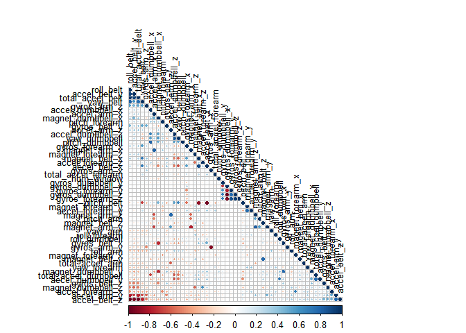
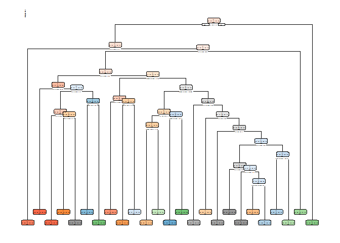
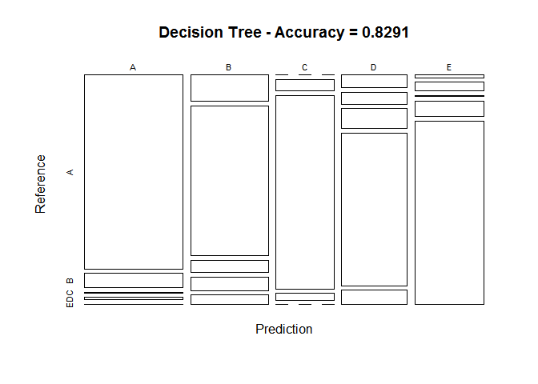
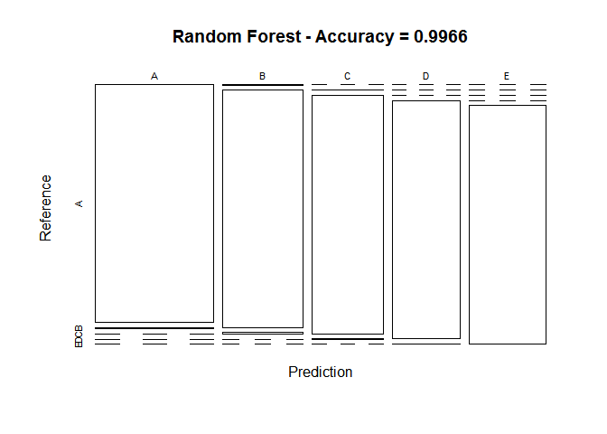

Practical Machine Learning - Coursera Project
===============================================

#OVERVIEW ::

The objective and goal of this project is to predict the manner in which they performed the exercise and machine learning classification of accelerometers data on the belt, forearm, arm, and dumbell of 6 participants.The main goal of the project is to predict the manner in which 6 participants performed some exercise. In training data ???classe??? is the outcome variable in the training set using predictor variables to predict 20 different test cases.The data for this project come from this source is: http://groupware.les.inf.puc-rio.br/har

#Background
Using devices such as Jawbone Up, Nike FuelBand, and Fitbit it is now possible to collect a large amount of data about personal activity relatively inexpensively. These type of devices are part of the quantified self movement ??? a group of enthusiasts who take measurements about themselves regularly to improve their health, to find patterns in their behavior, or because they are tech geeks. One thing that people regularly do is quantify how much of a particular activity they do, but they rarely quantify how well they do it. In this project, your goal will be to use data from accelerometers on the belt, forearm, arm, and dumbell of 6 participants. They were asked to perform barbell lifts correctly and incorrectly in 5 different ways. More information is available from the website here: http://web.archive.org/web/20161224072740/http:/groupware.les.inf.puc-rio.br/har

#Data

The training data for this project are available here:

https://d396qusza40orc.cloudfront.net/predmachlearn/pml-training.csv

The test data are available here:

https://d396qusza40orc.cloudfront.net/predmachlearn/pml-testing.csv

The data for this project come from this source: http://web.archive.org/web/20161224072740/http:/groupware.les.inf.puc-rio.br/har

#Exploratory Analysis ::

```r
library(knitr)
library(caret)
```

```
## Loading required package: lattice
```

```
## Loading required package: ggplot2
```

```r
library(e1071)
library(rpart)
library(rpart.plot)
library(randomForest)
```

```
## randomForest 4.6-12
```

```
## Type rfNews() to see new features/changes/bug fixes.
```

```
## 
## Attaching package: 'randomForest'
```

```
## The following object is masked from 'package:ggplot2':
## 
##     margin
```

```r
library(corrplot)
library(RColorBrewer)

set.seed(301)
```

#Data Loading and Pre Processing
The training dataset is then partinioned in 2 to create a Training set (70% of the data) for the modeling process and a Test set (with the remaining 30%) for the validations. The testing dataset is not changed and will only be used for the quiz results generation.


```r
TrainUrl <- "https://d396qusza40orc.cloudfront.net/predmachlearn/pml-training.csv"
TestUrl  <- "https://d396qusza40orc.cloudfront.net/predmachlearn/pml-testing.csv"
TrainFile<-"pml-traininig.csv"
TestFile<-"pml-testing.csv"

# download the datasets
if(!file.exists(TrainFile))
{
    download.file(TrainUrl,destfile = TrainFile)
}
training <- read.csv(TrainFile)
if(!file.exists(TestFile))
{
    download.file(TestUrl,destfile = TestFile)
}
testing  <- read.csv(TestFile)

# create a partition using caret with the training dataset on 70,30 ratio
inTrain  <- createDataPartition(training$classe, p=0.7, list=FALSE)

TrainSet <- training[inTrain, ]

TestSet  <- training[-inTrain, ]
dim(TrainSet)
```

```
## [1] 13737   160
```

```r
dim(TestSet)
```

```
## [1] 5885  160
```

###Clean Non Zero Variable.

```r
NZV <- nearZeroVar(TrainSet)
TrainSet <- TrainSet[, -NZV]
TestSet  <- TestSet[, -NZV]
dim(TestSet)
```

```
## [1] 5885  106
```

```r
dim(TrainSet)
```

```
## [1] 13737   106
```

```r
# remove variables that are mostly NA
AllNA    <- sapply(TrainSet, function(x) mean(is.na(x))) > 0.95
TrainSet <- TrainSet[, AllNA==FALSE]
TestSet  <- TestSet[, AllNA==FALSE]
dim(TestSet)
```

```
## [1] 5885   59
```

```r
dim(TrainSet)
```

```
## [1] 13737    59
```

```r
# remove identification only variables (columns 1 to 5)
TrainSet <- TrainSet[, -(1:5)]
TestSet  <- TestSet[, -(1:5)]
dim(TrainSet)
```

```
## [1] 13737    54
```

#Rectification Analysis :-

```r
corMatrix <- cor(TrainSet[, -54])
corrplot(corMatrix, order = "FPC", method = "circle", type = "lower", 
         tl.cex = 0.8, tl.col = rgb(0, 0, 0))
```

<!-- -->

#Prediction Model
Prediction model is described based on the below methods. The methods are:  Decission Tree & Random Forests as described below.

# Decission Tree


```r
set.seed(12345)
modFitDecTree <- rpart(classe ~ ., data=TrainSet, method="class")
rpart.plot(modFitDecTree)
```

```
## Warning: labs do not fit even at cex 0.15, there may be some overplotting
```

<!-- -->


```r
# prediction on Test dataset
predictDecTree <- predict(modFitDecTree, newdata=TestSet, type="class")
confMatDecTree <- confusionMatrix(predictDecTree, TestSet$classe)
confMatDecTree
```

```
## Confusion Matrix and Statistics
## 
##           Reference
## Prediction    A    B    C    D    E
##          A 1441  107    2   15    5
##          B  156  880   73   80   56
##          C    0   48  848   29    0
##          D   64   58   98  761   72
##          E   13   46    5   79  949
## 
## Overall Statistics
##                                           
##                Accuracy : 0.8291          
##                  95% CI : (0.8192, 0.8386)
##     No Information Rate : 0.2845          
##     P-Value [Acc > NIR] : < 2.2e-16       
##                                           
##                   Kappa : 0.7843          
##  Mcnemar's Test P-Value : < 2.2e-16       
## 
## Statistics by Class:
## 
##                      Class: A Class: B Class: C Class: D Class: E
## Sensitivity            0.8608   0.7726   0.8265   0.7894   0.8771
## Specificity            0.9694   0.9231   0.9842   0.9407   0.9702
## Pos Pred Value         0.9178   0.7068   0.9168   0.7227   0.8690
## Neg Pred Value         0.9460   0.9442   0.9641   0.9580   0.9723
## Prevalence             0.2845   0.1935   0.1743   0.1638   0.1839
## Detection Rate         0.2449   0.1495   0.1441   0.1293   0.1613
## Detection Prevalence   0.2668   0.2116   0.1572   0.1789   0.1856
## Balanced Accuracy      0.9151   0.8479   0.9053   0.8650   0.9237
```


```r
# plot matrix results
plot(confMatDecTree$table, col = confMatDecTree$byClass, 
     main = paste("Decision Tree - Accuracy =",
                  round(confMatDecTree$overall['Accuracy'], 4)))
```

<!-- -->


Accuracy is more than 98% which is good,Lets check if Random forest accuracy is better that GBM.

#Random Forest

```r
set.seed(301) 
controlRF <- trainControl(method="cv", number=3, verboseIter=FALSE)
modFitRandForest <- train(classe ~ ., data=TrainSet, method="rf",
                          trControl=controlRF)
modFitRandForest$finalModel
```

```
## 
## Call:
##  randomForest(x = x, y = y, mtry = param$mtry) 
##                Type of random forest: classification
##                      Number of trees: 500
## No. of variables tried at each split: 27
## 
##         OOB estimate of  error rate: 0.27%
## Confusion matrix:
##      A    B    C    D    E  class.error
## A 3905    0    0    0    1 0.0002560164
## B    6 2648    3    1    0 0.0037622272
## C    0    7 2389    0    0 0.0029215359
## D    0    0   11 2240    1 0.0053285968
## E    0    1    0    6 2518 0.0027722772
```

```r
# prediction on Test dataset
predictRandForest <- predict(modFitRandForest, newdata=TestSet)
confMatRandForest <- confusionMatrix(predictRandForest, TestSet$classe)
confMatRandForest
```

```
## Confusion Matrix and Statistics
## 
##           Reference
## Prediction    A    B    C    D    E
##          A 1673   10    0    0    0
##          B    1 1128    6    0    0
##          C    0    1 1020    1    0
##          D    0    0    0  963    1
##          E    0    0    0    0 1081
## 
## Overall Statistics
##                                           
##                Accuracy : 0.9966          
##                  95% CI : (0.9948, 0.9979)
##     No Information Rate : 0.2845          
##     P-Value [Acc > NIR] : < 2.2e-16       
##                                           
##                   Kappa : 0.9957          
##  Mcnemar's Test P-Value : NA              
## 
## Statistics by Class:
## 
##                      Class: A Class: B Class: C Class: D Class: E
## Sensitivity            0.9994   0.9903   0.9942   0.9990   0.9991
## Specificity            0.9976   0.9985   0.9996   0.9998   1.0000
## Pos Pred Value         0.9941   0.9938   0.9980   0.9990   1.0000
## Neg Pred Value         0.9998   0.9977   0.9988   0.9998   0.9998
## Prevalence             0.2845   0.1935   0.1743   0.1638   0.1839
## Detection Rate         0.2843   0.1917   0.1733   0.1636   0.1837
## Detection Prevalence   0.2860   0.1929   0.1737   0.1638   0.1837
## Balanced Accuracy      0.9985   0.9944   0.9969   0.9994   0.9995
```

```r
# plot matrix results
plot(confMatRandForest$table, col = confMatRandForest$byClass, 
     main = paste("Random Forest - Accuracy =",
                  round(confMatRandForest$overall['Accuracy'], 4)))
```

<!-- -->

##Applying the Selected Model to the Test Data
The accuracy of the 2 regression modeling methods above are:

Decission Tree: 0.8291 
Random Forest : 0.9966

In that case, the Random Forest model will be applied to predict the 20 quiz results (testing dataset) as shown below.


```r
predictTEST <- predict(modFitRandForest, newdata=testing)
predictTEST
```

```
##  [1] B A B A A E D B A A B C B A E E A B B B
## Levels: A B C D E
```


#End
